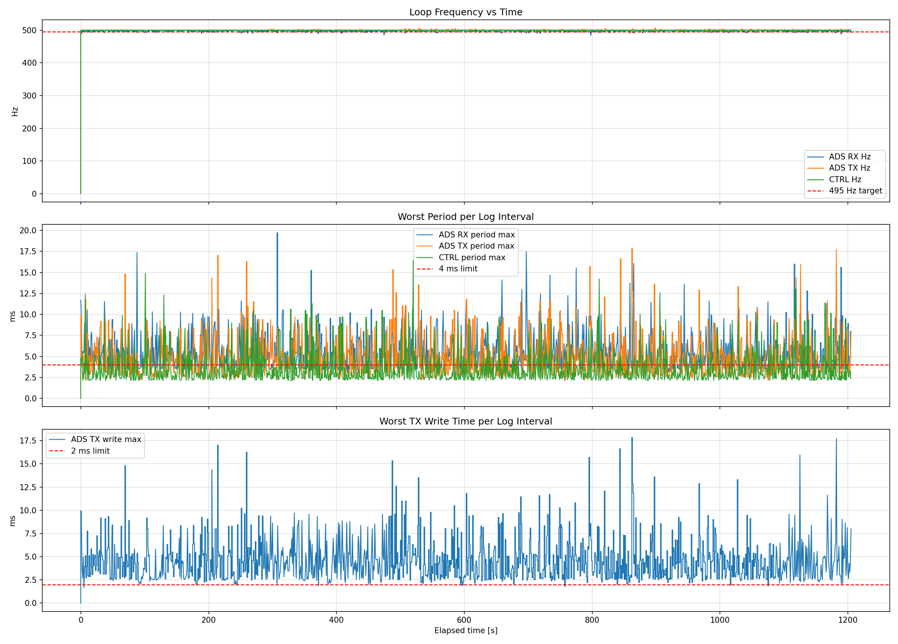
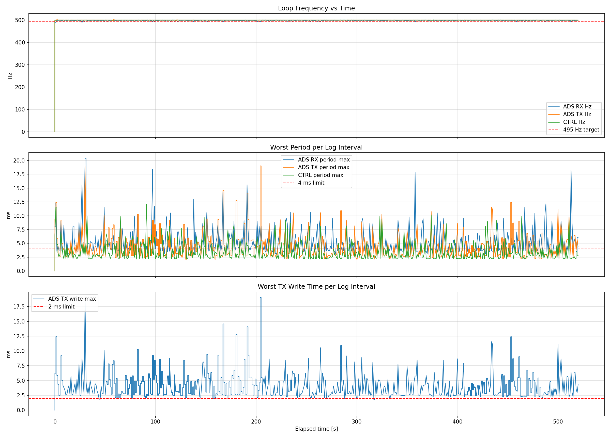

# ADS Control Test

Ubuntu 22.04에서 Beckhoff TwinCAT PLC와 ADS로 통신하면서 제어기를 구동하는 테스트 프로젝트다.

현재 프로젝트는 다음 구조와 목적에 맞춰 정리되어 있다.

- PCAN 제거
- ADS만 사용
- 제어 스레드와 통신 스레드 분리
- ADS RX/TX를 각각 독립 스레드로 분리
- RX는 기본 `MotorStatus` bundle/array 경로에서 ADS notification 사용
- TX는 기본 `MotorCmd` bundle/array 경로에서 blob write 사용
- RX/TX/CTRL 타이밍을 1초 단위로 로깅
- CSV 저장 및 Jupyter 분석 지원
- ROS 2 topic publish는 별도 스레드로 분리

## 구조

현재 런타임 구조는 기본적으로 다음 스레드로 동작한다.

- `CTRL thread`
  - 2 ms 주기
  - 제어 계산 수행
- `ADS RX thread`
  - TwinCAT notification으로 들어온 최신 피드백 캐시 사용
  - 현재 기본 preset에서는 `GVL_Status.MotorStatus` 전체 struct/배열을 받아 `mjustate.Sim.*` 갱신
- `ADS TX thread`
  - 2 ms 주기
  - 최신 제어 명령을 Beckhoff로 write
- `Timing logger thread`
  - 옵션
  - RX/TX/CTRL timing을 주기적으로 콘솔/CSV로 기록
- `ROS publish thread`
  - 옵션
  - `mjustate`를 ROS 2 topic으로 publish

즉 보통은 다음처럼 이해하면 된다.

- ROS off: `CTRL + ADS RX + ADS TX (+ timing logger)`
- ROS on: `CTRL + ADS RX + ADS TX + ROS publish (+ timing logger)`

핵심 구현 위치:

- ADS 모듈: `includes/ads/ads_motor_io.hpp`, `src/ads/ads_motor_io.cpp`
- 메인 런타임: `src/main.cpp`
- 제어 루프: `src/control/ControllerLoop.cpp`
- 모터축 -> 조인트축 상태 반영: `src/control/MjuJoint.cpp`
- ROS publish: `includes/ros/MjuStatePublisher.hpp`, `src/ros/MjuStatePublisher.cpp`

## TwinCAT 설정

현재 기본 ADS preset은 아래 TwinCAT PLC 구조를 기준으로 잡혀 있다.

```iecst
{attribute 'pack_mode' := '1'}
TYPE ST_MotorCmd :
STRUCT
    bEnable        : BOOL;
    fRefPos_deg    : LREAL;
    fRefVel_dps    : LREAL;
    fRefIq_A       : LREAL;
    nKp            : UINT;
    nKd            : UINT;
END_STRUCT
END_TYPE

{attribute 'pack_mode' := '1'}
TYPE ST_MotorStatus :
STRUCT
    nSelectedMode  : USINT;
    nFaultCode     : USINT;
    fActPos_deg    : LREAL;
    fActVel_dps    : LREAL;
    fActIq_A       : LREAL;
    nBusVoltageRaw : UINT;
    nTempMotor_C   : SINT;
    nTempMosfet_C  : SINT;
    nEncoderPosRaw : UINT;
    bFault         : BOOL;
END_STRUCT
END_TYPE

VAR_GLOBAL
    MotorCmd    : ARRAY[1..4] OF ST_MotorCmd;
    MotorStatus : ARRAY[1..4] OF ST_MotorStatus;
END_VAR
```

중요한 점:

- 현재 권장 경로는 `GVL_Cmd.MotorCmd : ARRAY[1..4] OF ST_MotorCmd`, `GVL_Status.MotorStatus : ARRAY[1..4] OF ST_MotorStatus`다.
- `--ads-motorstatus-prefix GVL_Status.MotorStatus`를 쓰면 RX가 배열 전체를 notification/read로 한 번에 받는다.
- `--ads-motorcmd-prefix GVL_Cmd.MotorCmd`를 쓰면 TX가 배열 전체를 blob으로 한 번에 write한다.
- 같은 prefix 경로는 단일 struct 심볼도 여전히 지원하지만, 현재 프로젝트의 기본 성능 경로는 4축 배열 blob이다.
- blob read/write를 안정적으로 쓰려면 TwinCAT 타입에 `{attribute 'pack_mode' := '1'}`를 꼭 주는 것이 좋다.
- 현재 PLC 예시 기준 타입은 `feedback=lreal`, `command=lreal`, `reference=lreal`, `gain=uint`다.
- `--ads-pos-unit deg`, `--ads-vel-unit deg`를 쓰면 struct TX에서 ref가 `deg`/`deg/s`로 기록되고, RX에서는 PLC의 `deg`/`deg/s` 피드백이 내부 `rad`/`rad/s`로 변환된다.
- `--ads-command-source iq`를 쓰면 `fRefIq_A` 필드에 iq command 경로 값을 기록한다. 현재 구현은 별도 Ampere 보정값이 아니라 내부 iq command 경로 기준이다.
- 예전 `MAIN.motorPos` / `MAIN.motorOutput` 배열/번들 방식도 기존 옵션으로 계속 지원한다.

### Task 주기

TwinCAT PLC task는 반드시 `2 ms`로 설정해야 한다.

확인 경로:

- `SYSTEM -> Real-Time -> Tasks -> PlcTask`

권장 값:

- `Cycle time = 2.000 ms`

`10 ms` task로 두면 RX notification도 `100 Hz` 근처로 제한된다.

### ADS Route

유선 기준으로 테스트했다.

- Ubuntu `eno1`: `192.168.50.10`
- Beckhoff `Ethernet 3`: `192.168.50.20`
- Beckhoff AMS Net ID: `192.168.0.100.1.1`
- Ubuntu AMS Net ID: `192.168.50.10.1.1`

TwinCAT route에는 Ubuntu를 다음 값으로 등록한다.

- Address: `192.168.50.10`
- AMS Net ID: `192.168.50.10.1.1`
- Transport: `TCP/IP`

Linux ADS 클라이언트 대상이므로 route 추가 시 `Unidirectional` 사용이 안전하다.

### 유선 IPv4 맞추기

#### Ubuntu 22.04

이 프로젝트에서는 Ubuntu 유선 NIC `eno1`를 다음 값으로 사용했다.

- IP: `192.168.50.10`
- Netmask: `255.255.255.0`

`nmcli`로 설정하는 예:

1. 연결 이름 확인

```bash
nmcli connection show
```

2. 유선 연결에 고정 IP 적용

```bash
sudo nmcli connection modify "Wired connection 1" \
  ipv4.method manual \
  ipv4.addresses 192.168.50.10/24 \
  ipv4.gateway "" \
  ipv4.dns "" \
  connection.interface-name eno1

sudo nmcli connection up "Wired connection 1"
```

3. 확인

```bash
ip addr show eno1
ping -I eno1 192.168.50.20
```

연결 이름이 `Wired connection 1`이 아니면 실제 이름으로 바꿔야 한다.

#### Windows / Beckhoff

이 프로젝트에서는 Beckhoff 유선 NIC `Ethernet 3`를 다음 값으로 사용했다.

- IP: `192.168.50.20`
- Subnet mask: `255.255.255.0`
- Default gateway: 비움

설정 순서:

1. `Control Panel -> Network and Internet -> Network Connections`
2. `Ethernet 3` 우클릭
3. `Properties`
4. `Internet Protocol Version 4 (TCP/IPv4)` 선택
5. `Properties`
6. `Use the following IP address` 선택
7. 아래 값 입력

```text
IP address:      192.168.50.20
Subnet mask:     255.255.255.0
Default gateway: (empty)
DNS:             (empty)
```

8. `OK`
9. `OK`

확인:

```bat
ipconfig
ping 192.168.50.10
```

주의:

- Wi-Fi 대역 `192.168.79.x`와 유선 대역 `192.168.50.x`를 혼용하지 않는 것이 좋다
- ADS 실행 시 `--ads-remote-ip`, `--ads-local-net-id`도 유선 기준 값으로 맞춰야 한다

## 빌드

### ROS 2 / colcon

```bash
cd /home/drcl-rss/Music/test/ADS2ROS
source /opt/ros/$ROS_DISTRO/setup.zsh
colcon build --packages-select ads_control_test
```

실행 파일:

```bash
install/ads_control_test/lib/ads_control_test/CAN_RMD
```

기존 standalone CMake 방식도 그대로 가능하다.

### Standalone CMake

```bash
cmake -S src/ADS -B build/ads_control_test
cmake --build build/ads_control_test -j --target CAN_RMD
```

실행 파일:

```bash
build/ads_control_test/CAN_RMD
```

### ROS 2 publish / TEST config control

`CAN_RMD`는 별도 ROS thread에서 상태 토픽을 퍼블리시하고, TEST 모드 설정 입력도 받을 수 있다.

- `/ads/mju_state`
  - `std_msgs/msg/Float64MultiArray`
  - `mjustate` 전체 스냅샷을 flat array로 퍼블리시
- `/joint_states`
  - `sensor_msgs/msg/JointState`
  - `Sim` 기준 `position=joint`, `velocity=joint`
  - `effort`는 비움
- `/joint_states_ref`
  - `sensor_msgs/msg/JointState`
  - `Ref` 기준 `position=joint`, `velocity=joint`, `effort=joint torque`
- `/motor_states`
  - `sensor_msgs/msg/JointState`
  - `Sim` 기준 `position=motor`, `velocity=motor`, `effort=motor torque`
- `/motor_states_ref`
  - `sensor_msgs/msg/JointState`
  - `Ref` 기준 `position=motor`, `velocity=motor`, `effort=motor torque`
- `/ads/test_config_state`
  - `std_msgs/msg/Float64MultiArray`
  - 현재 TEST 설정과 모드 상태를 `[motor_index, amplitude_rad, frequency_hz, current_mode, change_counter]` 순서로 퍼블리시

- `/ads/test_config_cmd`
  - `std_msgs/msg/Float64MultiArray`
  - TEST 설정 입력용 토픽
  - `data[0] = motor_index (0..3: motor1..motor4, 4: all)`
  - `data[1] = amplitude_rad`
  - `data[2] = frequency_hz`
  - 길이가 1 또는 2여도 허용하며, 빠진 항목은 기존 값을 유지한다
  - 값이 실제로 바뀐 경우에만 sine phase와 `joint*_init` 기준점을 다시 잡는다

퍼블리시 주기 기본값은 `30 Hz`이고, 실행 시 `--ros-publish-rate-hz <hz>`로 변경할 수 있다.

예시:

```bash
ros2 topic pub --once /ads/test_config_cmd std_msgs/msg/Float64MultiArray \
  "{data: [2, 0.35, 0.5]}"
```

- 위 예시는 `joint3`에 진폭 `0.35 rad`, 주파수 `0.5 Hz` sine test를 건다.
- 위 예시는 `motor3`에 진폭 `0.35 rad`, 주파수 `0.5 Hz` sine test를 건다.
- `motor_index=4`를 보내면 4개 motor 모두에 같은 sine을 적용한다.

`/ads/mju_state.data` 길이는 `170` 이고 인덱스 의미는 다음과 같다.

- `[0:16)` `Sim.Pos`
- `[16:32)` `Sim.Vel`
- `[32:48)` `Sim.Acc`
- `[48:64)` `Sim.Tau`
- `[64:67)` `Sim.Tip_pos = [x, y, z]`
- `[67:70)` `Sim.Tip_vel = [x, y, z]`
- `[70:73)` `Sim.Tip_acc = [x, y, z]`
- `[73:76)` `Sim.Tip_tau = [x, y, z]`
- `[76:85)` `Sim.scalar = [x_init, y_init, z_init, CoM_x, CoM_y, CoM_z, CoM_roll, CoM_pitch, CoM_yaw]`
- `[85:101)` `Ref.Pos`
- `[101:117)` `Ref.Vel`
- `[117:133)` `Ref.Acc`
- `[133:149)` `Ref.Tau`
- `[149:152)` `Ref.Tip_pos = [x, y, z]`
- `[152:155)` `Ref.Tip_vel = [x, y, z]`
- `[155:158)` `Ref.Tip_acc = [x, y, z]`
- `[158:161)` `Ref.Tip_tau = [x, y, z]`
- `[161:170)` `Ref.scalar = [x_init, y_init, z_init, CoM_x, CoM_y, CoM_z, CoM_roll, CoM_pitch, CoM_yaw]`

각 `Pos/Vel/Acc/Tau` 블록은 `16`개 값이며 순서는 항상 아래와 같다.

- `[0:4)` `joint1..4`
- `[4:8)` `joint1_pre..4`
- `[8:12)` `joint1_init..4`
- `[12:16)` `motor1..4`

ROS 퍼블리시를 끄고 싶으면 다음 옵션을 사용한다.

```bash
--ros-disable-publish
```

토픽 확인 예:

```bash
source /opt/ros/$ROS_DISTRO/setup.zsh
source /home/drcl-rss/Music/test/ADS2ROS/install/setup.zsh
ros2 topic list
ros2 topic echo /ads/mju_state
ros2 topic echo /joint_states
ros2 topic echo /joint_states_ref
ros2 topic echo /motor_states
ros2 topic echo /motor_states_ref
```

## 실행

### ROS 2 패키지 실행

```bash
cd /home/drcl-rss/Music/test/ADS2ROS
source /opt/ros/$ROS_DISTRO/setup.zsh
source install/setup.zsh

ros2 run ads_control_test CAN_RMD -- \
  --ros-publish-rate-hz 30 \
  --ads-remote-ip 192.168.50.20 \
  --ads-remote-net-id 192.168.0.100.1.1 \
  --ads-local-net-id 192.168.50.10.1.1 \
  --ads-motorstatus-prefix GVL_Status.MotorStatus \
  --ads-motorcmd-prefix GVL_Cmd.MotorCmd \
  --ads-feedback-plc-type lreal \
  --ads-command-plc-type lreal \
  --ads-reference-plc-type lreal \
  --ads-gain-plc-type uint \
  --ads-command-source iq \
  --ads-pos-unit deg \
  --ads-vel-unit deg \
  --ads-timing-log-ms 1000 \
  /home/drcl-rss/Music/test/ADS2ROS/src/ADS/model/urdf/CRM_SUB.urdf
```

위 예시는 현재 `ARRAY[1..4] OF ST_MotorCmd/ST_MotorStatus` + `LREAL/LREAL/LREAL/UINT` TwinCAT 구조에 맞춘 기본 실행 예다.

ROS publish를 끄고 제어 + ADS 경로만 확인하고 싶으면 아래 옵션을 추가한다.

```bash
--ros-disable-publish
```

### Standalone 실행

기본 full mode:

```bash
./CAN_RMD \
  --ads-remote-ip 192.168.50.20 \
  --ads-remote-net-id 192.168.0.100.1.1 \
  --ads-local-net-id 192.168.50.10.1.1 \
  --ads-motorstatus-prefix GVL_Status.MotorStatus \
  --ads-motorcmd-prefix GVL_Cmd.MotorCmd \
  --ads-feedback-plc-type lreal \
  --ads-command-plc-type lreal \
  --ads-reference-plc-type lreal \
  --ads-gain-plc-type uint \
  --ads-command-source iq \
  --ads-pos-unit deg \
  --ads-vel-unit deg \
  --ads-timing-log-ms 1000 \
  model/urdf/CRM_SUB.urdf
```

write-only:

```bash
./CAN_RMD \
  --ads-write-only \
  --ads-remote-ip 192.168.50.20 \
  --ads-remote-net-id 192.168.0.100.1.1 \
  --ads-local-net-id 192.168.50.10.1.1 \
  --ads-motorcmd-prefix GVL_Cmd.MotorCmd \
  --ads-command-plc-type lreal \
  --ads-reference-plc-type lreal \
  --ads-gain-plc-type uint \
  --ads-command-source iq \
  --ads-pos-unit deg \
  --ads-vel-unit deg \
  --ads-timing-log-ms 1000 \
  model/urdf/CRM_SUB.urdf
```

read-only:

```bash
./CAN_RMD \
  --ads-read-only \
  --ads-remote-ip 192.168.50.20 \
  --ads-remote-net-id 192.168.0.100.1.1 \
  --ads-local-net-id 192.168.50.10.1.1 \
  --ads-motorstatus-prefix GVL_Status.MotorStatus \
  --ads-feedback-plc-type lreal \
  --ads-pos-unit deg \
  --ads-vel-unit deg \
  --ads-timing-log-ms 1000 \
  model/urdf/CRM_SUB.urdf
```

## 타이밍 로깅

`--ads-timing-log-ms 1000`을 주면 콘솔에 다음이 출력된다.

- `ADS RX timing`
- `ADS TX timing`
- `CTRL timing`

동시에 CSV도 자동 저장된다.

저장 경로:

- `test/YYYYMMDD_HHMMSS.csv`

CSV 컬럼:

- `wall_time`
- `mode`, `mode_id`, `fsm_mode_count`
- `ads_rx_*`
- `ads_tx_*`
- `ctrl_*`

### 실험 결과: 실제 모터 + TwinCAT + EtherCAT

실험 요약본:

- [공유용 실험 매뉴얼](docs/ads_ethercat_experiment_manual.md)
- [GitHub-rendered report](docs/ethercat_experiment_summary_20260325.md)
- `docs/ethercat_experiment_summary_20260325.html`
- `test/ethercat_experiment_summary_20260325.pdf`

참고:

- GitHub에서는 `.md` 링크가 가장 안정적으로 바로 렌더된다.
- `docs/ethercat_experiment_summary_20260325.html`은 GitHub 파일 화면에서는 source/blob 형태로 보일 수 있다.
- 필요하면 나중에 GitHub Pages를 켠 뒤 같은 문서를 별도 웹 페이지로 연결할 수 있다.

#### 1. Multiturn Position Control

파일:

- `test/multiturn_pos_etherCAT.csv`

조건:

- 날짜: `2026-03-25`
- 플랫폼: `Up Xtreme + Ubuntu 22.04`
- PLC/필드버스: `TwinCAT + EtherCAT`
- 실제 모터 연결 상태
- 제어 모드: `multiturn position control`
- ROS publish: `30 Hz`
- ADS 경로: `GVL_Cmd.MotorCmd`, `GVL_Status.MotorStatus` 4축 배열 blob 경로

steady-state 해석(초기 10개 row 제외):

- `ads_rx_hz` 평균: `497.447 Hz`
- `ads_tx_hz` 평균: `500.000 Hz`
- `ctrl_hz` 평균: `500.000 Hz`
- `ads_rx_read_avg_ms` 평균: `0.00196 ms`
- `ads_tx_write_avg_ms` 평균: `1.432 ms`
- `ctrl_cycle_avg_ms` 평균: `0.106 ms`

worst-case 요약:

- `ads_rx_period_max_ms` 최대: `19.720 ms`
- `ads_tx_period_max_ms` 최대: `17.846 ms`
- `ctrl_period_max_ms` 최대: `16.456 ms`
- `ads_tx_write_max_ms` 최대: `17.843 ms`

해석:

- 평균 주파수 기준으로는 `RX/TX/CTRL` 모두 목표 `500 Hz`에 매우 가깝다.
- `RX`는 notification 경로라 평균 read 시간이 매우 작고, 이번 실험에서는 polling 병목이 보이지 않는다.
- `TX`는 평균 write 시간이 `2 ms` budget 안에 들어오지만, 드물게 `10~20 ms`급 spike가 존재한다.
- spike는 존재하지만 빈도는 낮다. `> 16 ms` 초과 비율은 `ADS RX 0.3%`, `ADS TX 0.4%`, `CTRL 0.1%`, `ADS TX write 0.4%` 수준이었다.
- 따라서 현재 경로는 "평균 500 Hz 유지 + 드문 soft real-time spike 존재"로 보는 것이 맞다.

요약 그래프:



#### 2. Torque Control

파일:

- `test/torque_loop.csv`

조건:

- 날짜: `2026-03-25`
- 플랫폼: `Up Xtreme + Ubuntu 22.04`
- PLC/필드버스: `TwinCAT + EtherCAT`
- 실제 모터 연결 상태
- 제어 모드: `torque control`
- ROS publish: `30 Hz`
- ADS 경로: `GVL_Cmd.MotorCmd`, `GVL_Status.MotorStatus` 4축 배열 blob 경로

steady-state 해석(초기 10개 row 제외):

- `ads_rx_hz` 평균: `498.011 Hz`
- `ads_tx_hz` 평균: `500.000 Hz`
- `ctrl_hz` 평균: `500.000 Hz`
- `ads_rx_read_avg_ms` 평균: `0.00211 ms`
- `ads_tx_write_avg_ms` 평균: `1.418 ms`
- `ctrl_cycle_avg_ms` 평균: `0.112 ms`

worst-case 요약:

- `ads_rx_period_max_ms` 최대: `20.397 ms`
- `ads_tx_period_max_ms` 최대: `19.022 ms`
- `ctrl_period_max_ms` 최대: `12.096 ms`
- `ads_tx_write_max_ms` 최대: `19.019 ms`

해석:

- 토크 제어에서도 평균 주파수는 `RX/TX/CTRL` 모두 `500 Hz` 근처를 유지했다.
- `RX` notification 경로는 여전히 매우 가볍고, 평균 read overhead는 거의 증가하지 않았다.
- `TX` 평균 write 시간은 `1.418 ms`로 멀티턴 위치제어와 비슷한 수준이다.
- tail latency는 여전히 존재하지만, `ctrl_period_max_ms` tail은 멀티턴 위치제어보다 약간 낮게 나타났다.
- 따라서 토크 제어 모드에서도 현재 통신 경로는 평균 throughput은 안정적이고, 관리 포인트는 여전히 TX/CTRL tail latency다.

요약 그래프:



## 분석 노트북

분석 노트북:

- `test/analyze_timing.ipynb`

기능:

- 최신 CSV 자동 선택
- mode별 샘플 수/지속 시간
- RX/TX/CTRL 평균/중앙값/최대값
- threshold 초과 횟수
- 시간축 그래프
- worst-case row 추출

## 성능 해석

이 문서의 성능 해석은 아래 관점을 기준으로 정리한다.

- 동일 하드웨어 / 동일 제어 시나리오를 유지한 상태에서 로그를 해석한다.
- 평균 주파수뿐 아니라 `worst-case`, `threshold 초과 횟수`, `jitter`, `percentile`을 함께 본다.
- 필요 시 tracing으로 root cause를 추가 분석한다.

현재 문서에 남겨둔 기준 로그는 다음 두 실험이다.

- `20260325_multiturn_pos_etherCAT.csv`
  - 조건: `ROS on 30 Hz`, `Up Xtreme`, `real motor + TwinCAT + EtherCAT`
  - 제어 시나리오: `multiturn position control`
- `torque_loop.csv`
  - 조건: `ROS on 30 Hz`, `Up Xtreme`, `real motor + TwinCAT + EtherCAT`
  - 제어 시나리오: `torque control`
- 공통 ADS 경로: `4축 배열 blob + RX notification`

확인 우선순위:

1. `ads_rx_hz`, `ads_tx_hz`, `ctrl_hz`
2. `ads_rx_period_max_ms`, `ads_tx_period_max_ms`, `ctrl_period_max_ms`
3. `ads_tx_write_max_ms`, `ctrl_cycle_max_ms`
4. `ads_rx_period_std_ms`, `ads_tx_period_std_ms`, `ctrl_period_std_ms`

해석 포인트:

- 평균 Hz가 `495~500 Hz`면 양호하다.
- 평균보다 `worst-case`, `threshold 초과 횟수`, `tail latency`가 더 중요하다.
- `period_max_ms`가 가끔 `4~6 ms` 수준이면 soft real-time에서 볼 수 있다.
- `10 ms` 이상 spike가 자주 나오면 개선이 필요하다.
- `ads_tx_write_max_ms`가 커질수록 TX 여유가 줄어든다.
- `ctrl_period_max_ms`와 `ctrl_cycle_max_ms`는 실제 제어기 입장에서 가장 보수적으로 봐야 하는 지표다.

보조 확인:

- 필요 시 `ros2 topic hz /joint_states`
- 필요 시 `ros2 topic hz /joint_states_ref`
- 필요 시 `ros2 topic hz /motor_states`
- 필요 시 `ros2 topic hz /motor_states_ref`
- 필요 시 `ros2 topic hz /ads/mju_state`

방법론적 해석:

- `ads_rx_hz`, `ads_tx_hz`, `ctrl_hz`는 steady-state throughput/loop stability 지표다.
- `period_max_ms`, `write_max_ms`, `cycle_max_ms`는 worst-case latency/jitter 지표다.
- `> 4 ms` 초과 횟수는 단발성 outlier보다 반복적 deadline stress를 보기 위한 보조 지표다.
- `P95/P99/P99.9`는 tail latency가 얼마나 두꺼운지 보기 위한 지표다.

percentile 해석:

- `P95`: 평상시보다 약간 나쁜 구간
- `P99`: 눈에 띄는 지연이 포함되는 구간
- `P99.9`: 거의 worst-case에 가까운 tail latency
- `max` 하나만 보는 것보다 `P95/P99/P99.9`를 함께 보면 outlier와 반복적 jitter를 분리해서 볼 수 있다.

핵심 percentile 요약:

- `20260325_multiturn_pos_etherCAT.csv` (`ROS on 30 Hz`, Up Xtreme, real motor + TwinCAT + EtherCAT, multiturn position control)
  - `ads_rx_period_max_ms`: `P95 9.974`, `P99 13.359`, `P99.9 17.496`
  - `ads_tx_period_max_ms`: `P95 9.387`, `P99 13.513`, `P99.9 17.739`
  - `ads_tx_write_max_ms`: `P95 9.177`, `P99 13.295`, `P99.9 17.733`
  - `ctrl_period_max_ms`: `P95 8.191`, `P99 10.460`, `P99.9 14.888`
  - `ctrl_cycle_max_ms`: `P95 1.740`, `P99 4.770`, `P99.9 8.121`
- `torque_loop.csv` (`ROS on 30 Hz`, Up Xtreme, real motor + TwinCAT + EtherCAT, torque control)
  - `ads_rx_period_max_ms`: `P95 9.547`, `P99 15.623`, `P99.9 20.397`
  - `ads_tx_period_max_ms`: `P95 9.030`, `P99 12.774`, `P99.9 19.022`
  - `ads_tx_write_max_ms`: `P95 8.687`, `P99 12.771`, `P99.9 19.019`
  - `ctrl_period_max_ms`: `P95 7.467`, `P99 9.889`, `P99.9 12.096`
  - `ctrl_cycle_max_ms`: `P95 3.042`, `P99 5.293`, `P99.9 8.217`

percentile 결과 요약:

- 두 실험 모두 평균 주파수는 `RX/TX/CTRL` 기준으로 `500 Hz` 근처를 안정적으로 유지했다.
- 멀티턴 위치제어는 `ads_rx_period_max_ms`, `ctrl_period_max_ms` tail이 조금 더 완만한 편이었다.
- 토크 제어는 `ads_tx_write_max_ms`와 `ctrl_period_max_ms`의 `P95`가 약간 더 낮았지만, `P99.9/max`는 비슷한 tail을 유지했다.
- 따라서 두 모드 모두 현재 경로는 평균 `500 Hz` 유지와 드문 soft real-time spike가 공존하는 형태로 해석하는 것이 맞다.

핵심 지표 표:

| Case | Metric | Mean | Max | P95 | P99 | P99.9 |
| --- | --- | ---: | ---: | ---: | ---: | ---: |
| Up Xtreme EtherCAT multiturn 30 Hz | `ads_rx_period_max_ms` | 5.589 | 19.720 | 9.974 | 13.359 | 17.496 |
| Up Xtreme EtherCAT multiturn 30 Hz | `ads_tx_write_max_ms` | 4.630 | 17.843 | 9.177 | 13.295 | 17.733 |
| Up Xtreme EtherCAT multiturn 30 Hz | `ctrl_period_max_ms` | 3.573 | 16.456 | 8.191 | 10.460 | 14.888 |
| Up Xtreme EtherCAT torque 30 Hz | `ads_rx_period_max_ms` | 5.276 | 20.397 | 9.547 | 15.623 | 20.397 |
| Up Xtreme EtherCAT torque 30 Hz | `ads_tx_write_max_ms` | 4.190 | 19.019 | 8.687 | 12.771 | 19.019 |
| Up Xtreme EtherCAT torque 30 Hz | `ctrl_period_max_ms` | 3.548 | 12.096 | 7.467 | 9.889 | 12.096 |

표 해석:

- `Mean`은 전체적으로 얼마나 안정적으로 유지되는지 보는 값이다.
- `Max`는 한 번이라도 발생한 최악 지연이다.
- `P95`는 상위 `5%` 구간이 어느 정도부터 느려지는지 보여준다.
- `P99`는 눈에 띄는 지연이 반복적으로 나타나는지 판단하는 데 유용하다.
- `P99.9`는 거의 worst-case에 가까운 tail latency를 본다.

이 결과가 의미하는 바:

- 평균 주파수 기준으로는 현재 구성은 두 제어 모드 모두 충분히 안정적이다.
- `RX`는 notification 기반이라 두 실험 모두 평균 read overhead가 매우 작다.
- `TX` 평균 write 시간은 멀티턴 위치제어 `1.432 ms`, 토크 제어 `1.418 ms`로 둘 다 `2 ms` budget 안에 들어온다.
- 다만 `ads_tx_write_max_ms`, `ads_rx_period_max_ms`, `ctrl_period_max_ms`에는 여전히 tail latency가 존재한다.
- 따라서 현재 경로는 평균 `500 Hz` 유지에는 충분하지만, worst-case jitter는 계속 관리해야 하는 soft real-time 시스템으로 보는 것이 맞다.
- 다음 단계 최적화가 필요하다면 `TX write tail`과 `CTRL period tail`을 우선적으로 줄이는 방향이 맞다.

실무 판단 기준:

- 평균 `500 Hz` 유지 여부만 보면 현재 구성은 멀티턴 위치제어와 토크 제어 모두 사용 가능하다.
- 더 보수적인 실시간성을 원하면 `ads_tx_write_max_ms`, `ctrl_period_max_ms` tail을 중심으로 추가 원인 분석이 필요하다.

## 참고 문헌

아래 자료들은 현재 문서의 실시간 성능 해석 방식과 직접적으로 연결된다.

- ROS 2 official docs, "Understanding real-time programming"
  - https://docs.ros.org/en/humble/Tutorials/Demos/Real-Time-Programming.html
  - deadline, jitter, memory allocation, page fault 같은 실시간 평가 관점을 정리한 공식 문서다.

- Tobias Kronauer, Joshwa Pohlmann, Maximilian Matthé, Till Smejkal, Gerhard P. Fettweis, "Latency Analysis of ROS2 Multi-Node Systems", MFI 2021
  - https://arxiv.org/abs/2101.02074
  - ROS 2가 DDS와 설정에 따라 latency overhead를 만들 수 있음을 보여주며, end-to-end latency와 bottleneck 분석 관점을 제공한다.

- S. Barut, M. Boneberger, P. Mohammadi, J. J. Steil, "Benchmarking Real-Time Capabilities of ROS2 and OROCOS for Robotics Applications", ICRA 2021
  - https://www.rob.cs.tu-bs.de/node/1384
  - PREEMPT_RT 환경에서 ROS 2의 실시간 성능을 benchmark한 연구로, 본 프로젝트의 장시간 주기 해석과 가장 가까운 방법론이다.

- Christophe Bédard, Ingo Lütkebohle, Michel Dagenais, "ros2_tracing: Multipurpose Low-Overhead Framework for Real-Time Tracing of ROS 2", RA-L 2022
  - https://index.ros.org/r/ros2_tracing/
  - 현재처럼 CSV로 worst-case 증가를 찾은 뒤, spike 원인을 추적할 때 사용할 수 있는 tracing 도구와 논문이다.

- Huang et al., "ROS2 Real-time Performance Optimization and Evaluation", Chinese Journal of Mechanical Engineering, 2023
  - https://link.springer.com/article/10.1186/s10033-023-00976-5
  - frequency, DDS, QoS, load 조건에서 평균/최대 지연을 함께 평가한 사례로, publish rate sweep과 장시간 시험 설계에 참고할 수 있다.
